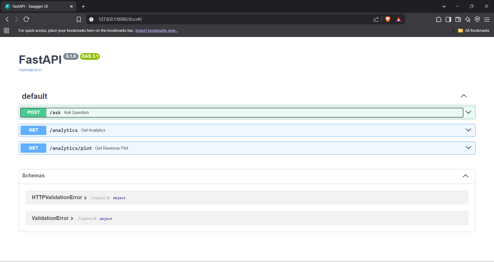
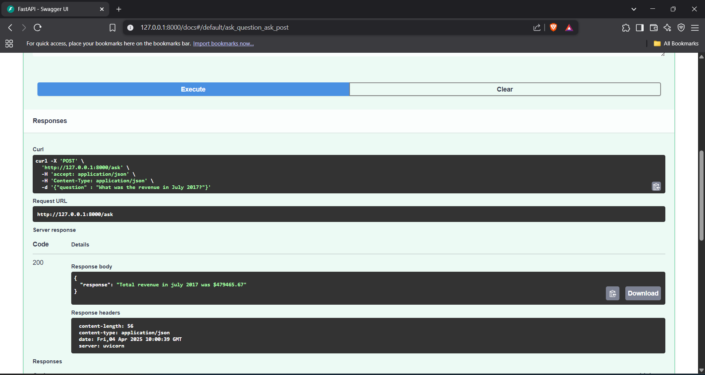

# Booking Analytics Q&A System

## Author: Gaganageethika Seerlancha 
## Project: Solvei8 AI/ML Internship Assignment  

## 📌 Description  
This project builds a **Booking Analytics Q&A System** that processes hotel booking data, implements rule-based logic + FAISS-based similarity search, uses a lightweight LLM fallback, generates revenue insights, and serves an API for querying data.

---

## 📂 Project Structure  

```
📁 BookingAnalyticsQA
│── 📁 data
│   ├── hotel_bookings.csv          # Raw dataset
│   ├── cleaned_bookings.csv        # Processed dataset
│   ├── faiss_index.bin             # FAISS index for similarity search
│   ├── revenue_trends.png          # Revenue trends visualization
│── 📁 notebooks
│   ├── datapreprocessing.ipynb     # Data cleaning and preprocessing
│── vector_store.py                 # FAISS vector storage creation
│── analytics.py                     # Revenue trend analysis
│── api.py                           # FastAPI server for Q&A & analytics
│── requirements.txt                 # Dependencies
│── README.md                        # Project documentation (this file)
```

---

## 🔧 Setup & Installation  

### 1️⃣ Install Dependencies  
Ensure Python (>=3.8) is installed and set up a virtual environment using **Anaconda**:

```bash
conda create --name booking_env python=3.8
conda activate booking_env
pip install -r requirements.txt
```

---

## 📊 Data Preprocessing (`datapreprocessing.ipynb`)
- Reads **hotel_bookings.csv**
- Cleans missing values
- Converts date formats
- Saves processed data as **cleaned_bookings.csv**

---

## 🔍 FAISS Vector Store (`vector_store.py`)
- Loads **cleaned_bookings.csv**
- Converts text data (hotel names) into embeddings using **Sentence Transformers**
- Stores embeddings in a **FAISS index**
- Saves the index to **faiss_index.bin**

Run the script:  
```bash
python vector_store.py
```

---

## 📈 Revenue Analytics (`analytics.py`)
- Reads **cleaned_bookings.csv**
- Calculates **monthly revenue trends**
- Saves the **revenue_trends.png** visualization
- Generates a **JSON insights report**

Run the script:  
```bash
python analytics.py
```

---

## 🌐 API (`api.py`)
Runs a FastAPI server with multiple endpoints:

### 1️⃣ Ask a Question (RAG-powered Search)
- Uses rule-based logic to answer known query patterns (e.g., revenue, cancellations, average price).
- Falls back to FAISS + LLM (Flan-T5-Small) if no match is found.
- **Endpoint:** `POST /ask`
- **Request:**  
  ```json
  { "question": "What was the total revenue in July 2017?" }
  ```
- **Response:**  
  ```json
  { "response": "Total revenue in July 2017 was 12345.67" }
  ```
## How Hybrid Question Answering Works
The `/ask endpoint` uses a hybrid approach:

- **✅ Rule-based Matching:**
For structured queries like:

  `"Total revenue for July 2017"`

  `"Top locations with cancellations"`

  `"Average price of a booking"`
  ...it responds immediately using precomputed insights or logic.

- **🔄 Fallback to FAISS + LLM:**
If the question doesn't match any known pattern:
    - Encodes the query with SentenceTransformers
    - Searches the FAISS index for the closest booking record
    - Uses Flan-T5-Small to generate a response based on that record

This ensures that even unseen natural language questions get a meaningful answer without overloading the LLM for every query.

**🧪 Sample Questions to Try**
 ```json
  { "question": "What was the total revenue in July 2017?" }
  { "question": "What was the total revenue for July 2017?" }
  { "question": "Which countries had the highest cancellations?" }
  { "question": "What's the average ADR?" }
  { "question": "How many rooms were booked last year?" }  ← Triggers LLM fallback
  ```

### 2️⃣ Get Analytics Data (JSON Format)
- **Endpoint:** `GET /analytics`
- **Response:** Returns monthly revenue insights in JSON format.

### 3️⃣ Revenue Trends Visualization (Image)
- **Endpoint:** `GET /analytics/plot`
- **Response:** Returns the revenue trends **PNG plot**.
 

Run the API server:

```bash
uvicorn api:app --host 127.0.0.1 --port 8000
```
--- 
### **🧪 API Testing with Swagger UI**
FastAPI provides a built-in interactive API documentation using Swagger UI. You can test your endpoints directly in your browser:

**📍 Steps:**
1. Run the server:
```bash
uvicorn api:app --host 127.0.0.1 --port 8000
```
2. Open your browser and navigate to:
```arduino
http://127.0.0.1:8000/docs
```
3. From there, you can:
  - Click on /ask, click "Try it out", and enter a question like:
  ```json
  {
    "question": "Which countries had the highest cancellations?"
  }
  ```
  - Use /analytics to view precomputed insights in JSON.
  - Use /analytics/plot to visualize revenue trends.

This makes it super convenient to explore and debug the API without needing any external tools like Postman or cURL.

---

## 🖼️ API Testing — Example Screenshots

### 🔹 Swagger UI Interface (`/docs`)


---

### 🔹 Example: Asking a Question (`/ask`)


## 🚀 Additional Features  
- ✅  **Pattern-matching** + **LLM** fallback (Hybrid Q&A system)
- ✅  **Retrieval-Augmented Generation** (RAG) using FAISS
- ✅  Insightful visualizations with **Matplotlib & Seaborn**
- ✅  **FastAPI + Swagger UI** for easy testing and documentation
- ✅  **Modular** structure and clean design for easy extensibility

  

